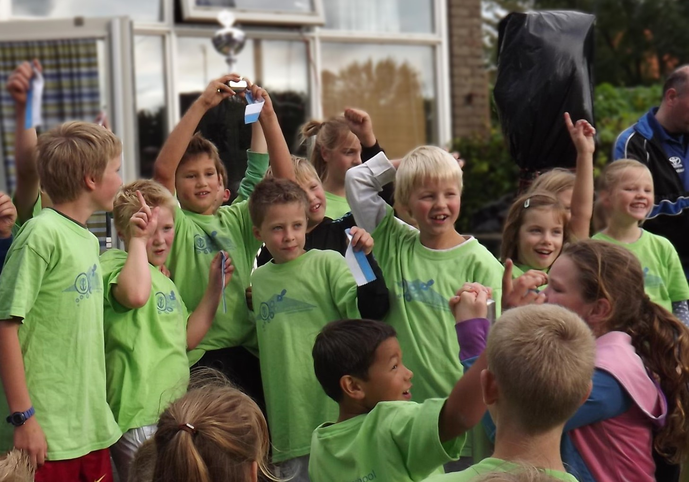

## about me

I'm Jasper,

The little guy slightly to the right from the centre in the picture me.jpg is me.
I would like for you to guess who I am based on this picture.



I enjoy coding and other computer related stuff.
I've been cursed/blessed with dyslexia.
Which has both good and bad sides and i hope it doesn't hinder me this course.

I'm looking forward to learning from this


## to use the code from this repository
To run the tests on pets.py code use:
```
pytest pets.py
```

To run the style checks use:
```
pycodestyle pets.py
pycodestyle test_assignment.py
```


## some of my favorite wikipedia pages

+ [korfbal](https://nl.wikipedia.org/wiki/Korfbal)
+ [groningen](https://nl.wikipedia.org/wiki/Groningen_(stad))
+ [food](https://nl.wikipedia.org/wiki/Eten)